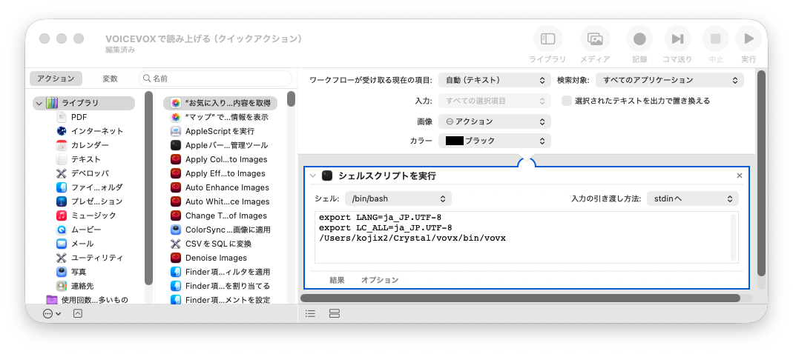

# VOVX

標準入力のテキストを [VOICEVOX](https://voicevox.hiroshiba.jp/) で音声合成し、簡単な GUI で再生する Crystal 製ツールです。
macOS の「サービス」>「アクション」から呼び出すことを想定しています。
句点、感嘆符、疑問符、改行で文章を分割し、音声の生成と再生を一文ずつ行います。再生中に次の音声を合成するため、途切れにくい読み上げができます。

:construction: このツールは作りかけです

## 前提

- VOICEVOX がインストールされていること
- VOICEVOX Engine は `http://localhost:50021` を使います。未起動の場合は、起動するか確認するダイアログを表示します。

## ビルド

```sh
make build
```

生成物:

```sh
bin/vovx
```

## 使い方

```sh
echo "読み上げる文章です。" | bin/vovx
```

標準入力が空の場合は終了します。起動後は GUI で声、速度、再生、停止を操作できます。
macOS の「サービス」>「アクション」から呼び出す想定のため、コマンドラインオプションではなく GUI で操作する作りにしています。



## ログ

通常は実行ファイルと同じ場所に `vovx.log` を出力します。出力先を変更する場合は `VOVX_LOG` を指定します。

```sh
echo "テスト" | VOVX_LOG=/tmp/vovx.log bin/vovx
```

## テスト

```sh
make spec
ameba
```
