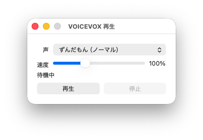

# VOVX

[](https://github.com/kojix2/vovx/actions/workflows/build.yml)
[](https://tokei.kojix2.net/github/kojix2/vovx)

標準入力のテキストを [VOICEVOX](https://voicevox.hiroshiba.jp/) で音声合成し、簡単な GUI で再生する Crystal 製ツールです。
macOS の「サービス」>「アクション」から呼び出すことを想定しています。
句点、感嘆符、疑問符、改行で文章を分割し、音声の生成と再生を一文ずつ行います。再生中に次の音声を合成するため、途切れにくい読み上げができます。



macOS の「サービス」>「アクション」から呼び出す想定のため、コマンドラインオプションではなく GUI で操作する作りにしています。

## 前提

- VOICEVOX がインストールされていること
- VOICEVOX Engine は `http://localhost:50021` を使います。未起動の場合は GUI の「起動」ボタンから VOICEVOX を起動できます。

## ビルド

### macOS

```sh
./build-mac.sh
```

成果物は `dist` ディレクトリに生成されます。

### Linux

```sh
make build release=1
```

生成物:

```sh
bin/vovx
```

## 使い方

### macOS

macOS アプリ版では、**初回起動した際にメニューの「Tools」>「サービスメニューに追加/更新」からサービスを登録してください**。

サービスを削除する場合は「Tools」>「サービスメニューから削除」を実行します。登録や削除がすぐに表示へ反映されない場合は、呼び出し元アプリを再起動してください。登録先を確認する場合は「Tools」>「サービスメニューのフォルダを開く」で `~/Library/Services` を開けます。

登録後は、対応アプリでテキストを選択し、コンテキストメニューまたはアプリケーションメニューの「サービス」から「VOICEVOXで読み上げる」を実行できます。

起動後は GUI で声、速度、再生、停止を操作できます。デフォルト設定では音声の生成と再生が正常に終わるとプログラムは終了します。

### Linux

```sh
echo "読み上げる文章です。" | bin/vovx
```

Linux などでは、サービスメニューの代替ルートとして、標準入力が空の場合にクリップボードの文字列を読み上げます。クリップボードの読み取りには `xsel` が必要です。

VOICEVOX が未起動の場合は、`gtk-launch`、desktop entry、Flatpak、PATH 上の `VOICEVOX`/`voicevox` の順に起動を試します。AppImage など場所が固定でない場合は、`VOVX_VOICEVOX_COMMAND` に起動コマンドを指定できます。

```sh
VOVX_VOICEVOX_COMMAND="$HOME/Applications/VOICEVOX.AppImage" bin/vovx
```

## 設定

声と速度は終了時に保存され、次回起動時に復元されます。保存先は macOS では `~/Library/Application Support/vovx/config.json`、Linux などでは `$XDG_CONFIG_HOME/vovx/config.json` または `~/.config/vovx/config.json` です。保存先を直接指定する場合は `VOVX_CONFIG` を使えます。

## ログ

通常は macOS では `~/Library/Logs/vovx/vovx.log`、Linux などでは `$XDG_STATE_HOME/vovx/vovx.log` または `~/.local/state/vovx/vovx.log` に出力します。出力先を変更する場合は `VOVX_LOG` を指定します。

```sh
echo "テスト" | VOVX_LOG=/tmp/vovx.log bin/vovx
```

## テスト

```sh
make spec
ameba
```
